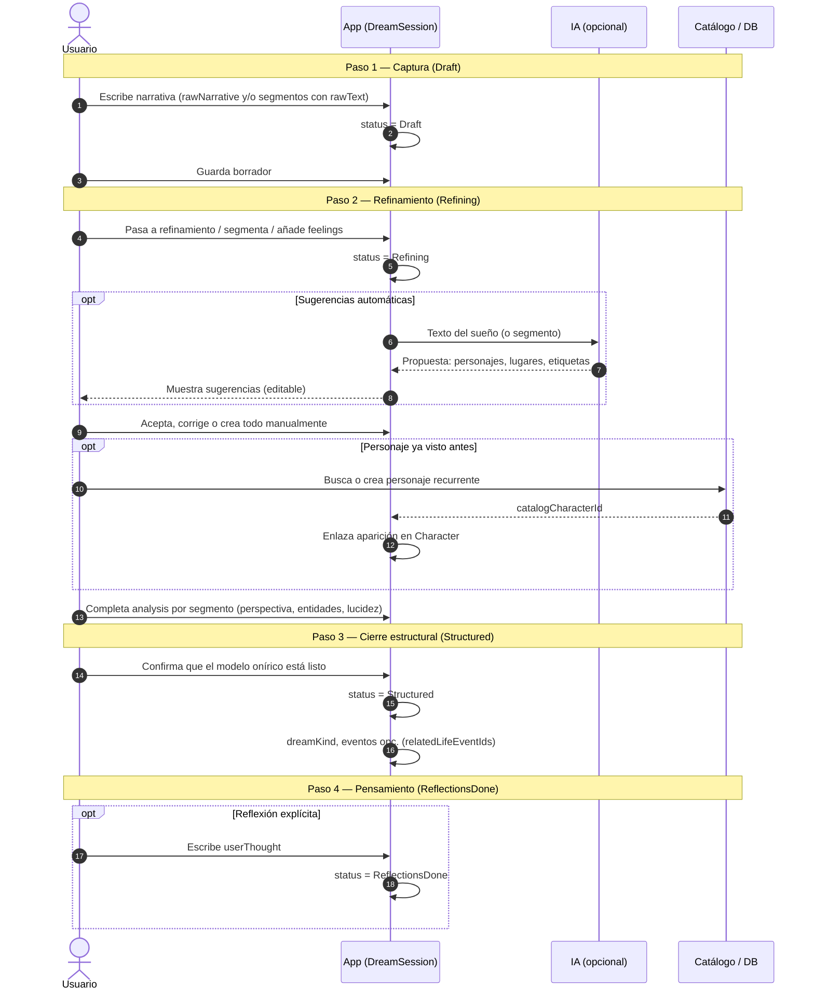

# Flujo de una sesión de sueño (diagrama de secuencia)

Describe cómo interactúan el usuario, la app, la IA opcional y el catálogo de personajes a lo largo de `DreamSessionStatus`.

## Estados y datos (referencia rápida)

| Estado en el diagrama | `DreamSessionStatus` | Idea |
|----------------------|----------------------|------|
| Captura | `Draft` | Texto; `analysis` puede faltar. |
| Refinamiento | `Refining` | Extracción manual o asistida; `analysis` se va llenando. |
| Cierre estructural | `Structured` | Entidades coherentes; listo para patrones / historial. |
| Pensamiento | `ReflectionsDone` | `userThought` registrado (paso opcional según producto). |

En GitHub, GitLab o editores con preview Mermaid el diagrama se renderiza solo. Si un paso es opcional en tu producto (por ejemplo saltar reflexión), el usuario puede quedarse en `Structured` sin pasar a `ReflectionsDone`.
